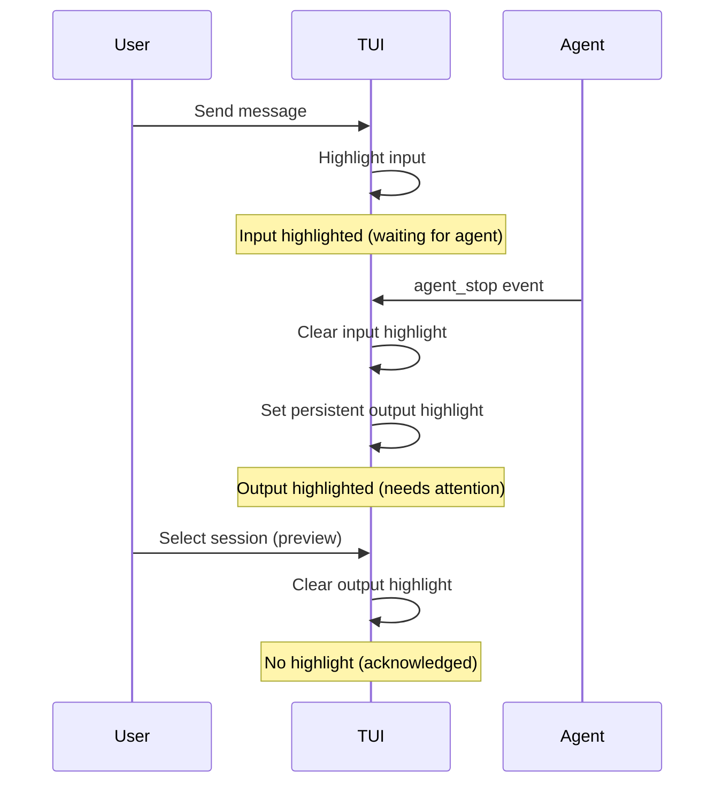
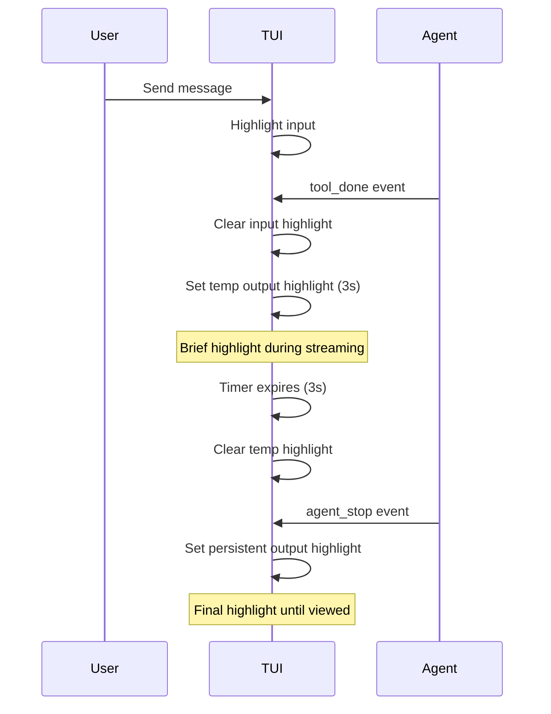
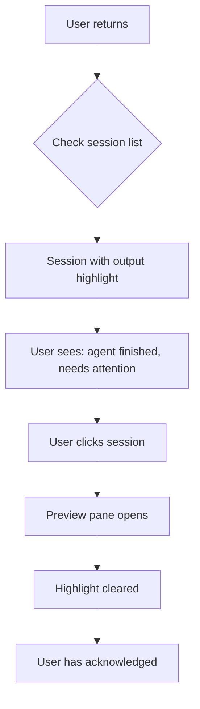

# Session Highlight — Design

## Purpose

The highlight system provides visual cues in the TUI to alert users about session activity requiring attention. It answers: "Which sessions need my attention?"

## Inputs/Outputs

**Inputs:**

- `user_input_sent` event — User sends a message to an agent
- `tool_done` event — Agent produces output (streaming, Gemini only currently)
- `agent_stop` event — Agent completes its turn
- User navigation — Selecting/previewing a session

**Outputs:**

- Visual highlight state per session (input highlighted, output highlighted, or neither)
- Highlight cleared when user acknowledges by viewing the session

## Invariants

1. **One highlight type per session**: A session has either input highlight, output highlight, or no highlight — never both simultaneously.

2. **Input highlight until agent responds**: When user sends input, the input is highlighted. This persists until the agent produces output, signaling the agent is working.

3. **Output highlight on agent completion**: When agent finishes (`agent_stop`), output is highlighted persistently until the user views it.

4. **Viewing clears output highlight**: Selecting a session (preview pane or sticky) acknowledges the output, clearing its highlight.

5. **Brief output highlight on streaming output**: For agents with streaming output (`tool_done` events), output is temporarily highlighted for 3 seconds, then cleared — unless `agent_stop` follows, which sets persistent highlight.

## Primary flows

### 1. User sends message, agent responds

### 2. Streaming agent output (Gemini)

### 3. User returns to laptop

## Failure modes

| Scenario                          | Behavior                               | Recovery                                                               |
| --------------------------------- | -------------------------------------- | ---------------------------------------------------------------------- |
| Event lost                        | Session may show stale highlight state | Next event corrects state; user can click to clear                     |
| Rapid events                      | Multiple events in quick succession    | Each event processed in order; final state wins                        |
| TUI restart                       | Highlight state lost                   | State persisted to `~/.teleclaude/tui_state.json`; restored on restart |
| Session deleted while highlighted | Orphaned highlight in state            | Highlight set garbage-collected when session no longer exists          |
