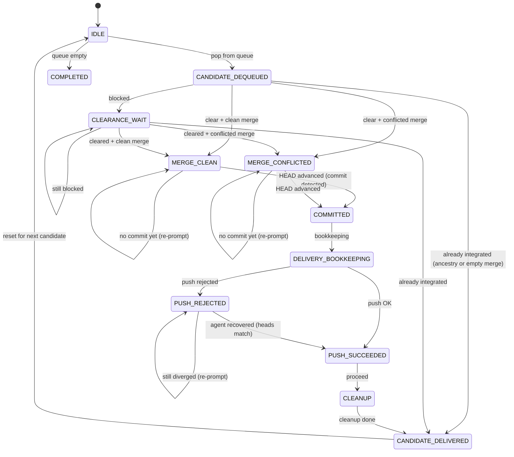

# Integration Orchestrator — Spec

## What it is

The Integration Orchestrator is the only role authorized to merge and push canonical `main`.
It is event-driven, queue-backed, and serialized by a lease so parallel workers can deliver safely
without race conditions on `main`.

This spec defines:

- canonical integration events and payload requirements,
- readiness conditions for integration candidates,
- singleton lease semantics,
- integrator lifecycle and shutdown behavior,
- self-end authorization boundaries for session types.

## Canonical fields

### Machine-Readable Surface

```yaml
integrator:
  authority:
    only_role_that_can_push_main: true
    workers_can_push_feature_branches: true

  trigger_events:
    - review_approved
    - finalize_ready
    - branch_pushed

  non_trigger_signals:
    - worktree_dirty_to_clean
    - heartbeat_only

  required_event_fields:
    review_approved:
      - slug
      - approved_at
      - review_round
      - reviewer_session_id
    finalize_ready:
      - slug
      - branch
      - sha
      - worker_session_id
      - orchestrator_session_id
      - ready_at
    branch_pushed:
      - branch
      - sha
      - remote
      - pushed_at
      - pusher
    integration_blocked:
      - slug
      - branch
      - sha
      - conflict_evidence
      - diagnostics
      - next_action
      - blocked_at

  readiness_predicate:
    all_required_events_present: true
    branch_matches_finalize_ready: true
    sha_matches_finalize_ready: true
    sha_reachable_on_remote_branch: true
    slug_not_superseded_by_newer_finalize_ready: true
    sha_not_already_integrated_to_main: true

  serialization:
    lease_key: integration/main
    single_active_holder: true
    queue_is_durable: true
    queue_order: fifo_by_ready_at

  lease_defaults:
    ttl_seconds: 120
    renew_every_seconds: 30
    stale_break_policy: allowed_when_expired

  main_branch_clearance:
    required_before_processing: true
    session_classification:
      workers_identified_by_initiator_session_id: true
      orchestrators_identified_by_worker_backreferences: true
      standalone_candidates_are_only_remaining_sessions: true
    standalone_activity_signal:
      source: telec sessions tail
      blocks_when_actively_modifying_main: true
      stale_or_idle_sessions_do_not_block: true
    retry_policy:
      wait_seconds: 60
      repeat_until_clear: true
    housekeeping_commit:
      allowed_when_no_active_standalone_on_main: true
      recheck_clean_tree_before_proceeding: true

  integrator_exit:
    allowed_when:
      - queue_empty
      - no_item_in_progress
      - lease_released
      - checkpoint_written
```

### Canonical Events

### `review_approved`

Meaning: slug has passed review gates and is eligible for finalize-prepare.

Required fields:

- `slug`
- `approved_at` (ISO8601)
- `review_round` (int)
- `reviewer_session_id`

### `finalize_ready`

Meaning: finalize-prepare completed in worktree and declared merge readiness.

Required fields:

- `slug`
- `branch`
- `sha` (branch HEAD used for integration)
- `worker_session_id`
- `orchestrator_session_id` (session that consumed worker output and recorded readiness)
- `ready_at` (ISO8601)

### `branch_pushed`

Meaning: the candidate commit is published to remote and can be integrated from canonical refs.

Required fields:

- `branch`
- `sha`
- `remote` (normally `origin`)
- `pushed_at` (ISO8601)
- `pusher` (identity label)

### `integration_blocked`

Meaning: the queued candidate could not proceed and requires remediation before retry.

Required fields:

- `slug`
- `branch`
- `sha`
- `conflict_evidence` (non-empty list; includes merge-conflict evidence when present)
- `diagnostics` (non-empty list of actionable blocking diagnostics)
- `next_action` (single remediation step)
- `blocked_at` (ISO8601)

### Readiness Predicate

An integration candidate `(slug, branch, sha)` is `READY` only when:

1. A `review_approved` exists for `slug`.
2. A `finalize_ready` exists for `(slug, branch, sha)`.
3. A `branch_pushed` exists for `(branch, sha)` on the configured remote.
4. `sha` is reachable from `origin/<branch>`.
5. No newer `finalize_ready` for the same `slug` supersedes this `(branch, sha)`.
6. `sha` is not already reachable from `origin/main`.

`worktree dirty -> clean` is explicitly not a readiness signal.

### Lease and Queue Semantics

### Lease

The integrator lease enforces singleton execution:

- Lease key: `integration/main`
- Required fields:
  - `owner_session_id`
  - `lease_token`
  - `acquired_at`
  - `renewed_at`
  - `expires_at`
- Acquisition must be atomic (compare-and-swap or equivalent).
- Renew every `renew_every_seconds`.
- If expired, a new session may acquire and continue queue processing.

### Queue

Queue is durable and event-derived:

- Items are candidates `(slug, branch, sha, ready_at)`.
- Enqueue only when predicate transitions from `NOT_READY` to `READY`.
- Deduplicate by `(slug, branch, sha)`.
- Process in FIFO order by `ready_at`.
- Keep status per item: `queued | in_progress | integrated | blocked | superseded`.

### Integrator Lifecycle

1. Event ingestion updates projection state for candidate readiness.
2. If any candidate becomes `READY`, attempt lease acquisition.
3. If lease is acquired:
   - start integrator session (or continue existing holder),
   - verify main-branch clearance (session + working tree hygiene),
   - then drain queue serially.
4. For each candidate:
   - re-check readiness predicate just before apply,
   - integrate from clean canonical refs,
   - emit `integration_completed` or `integration_blocked`.
5. When queue empty:
   - wait short grace window for late events,
   - if still empty, release lease and self-end.

Multiple trigger events may arrive concurrently; only one active lease holder processes them.
Other events are queued and consumed by that same active integrator.

### Integration Workflow Contract

For each queued candidate:

1. Prepare clean integration workspace from latest `origin/main`.
2. Merge `origin/<branch>` (or specific `sha`) into integration workspace.
3. If merge conflict:
   - emit `integration_blocked` with conflict files and slug/branch/sha,
   - mark queue item `blocked`,
   - do not push partial merge.
4. If merge succeeds:
   - push canonical `main`,
   - run delivery bookkeeping for non-bug slugs,
   - run demo snapshot/cleanup lifecycle,
   - emit `integration_completed`.

### Self-End Authorization Matrix

| Session type                    | Self-end allowed | Conditions                                                                 |
| ------------------------------- | ---------------- | -------------------------------------------------------------------------- |
| Builder / Reviewer / Fix worker | No               | Orchestrator owns completion and evidence consumption.                     |
| Finalizer (prepare stage)       | No               | Must emit `FINALIZE_READY`; orchestrator consumes evidence.                |
| Orchestrator (general)          | No               | Must remain resumable and externally controlled.                           |
| Integrator                      | Yes              | Queue empty, no in-progress candidate, lease released, checkpoint emitted. |
| Non-governed utility session    | Yes              | No pending governed handoff obligations.                                   |

### State Machine Internals

The integration state machine (`state_machine.py`) implements the workflow contract above
as a deterministic phase-driven loop. Each call to `telec todo integrate` reads a durable
checkpoint, executes one phase step, and either loops internally or returns an instruction
block to the agent.

#### Phase Enum

```
IDLE → CANDIDATE_DEQUEUED → CLEARANCE_WAIT → MERGE_CLEAN / MERGE_CONFLICTED
     → AWAITING_COMMIT → COMMITTED → DELIVERY_BOOKKEEPING
     → PUSH_SUCCEEDED / PUSH_REJECTED → CLEANUP → CANDIDATE_DELIVERED → (loop to IDLE)
     → COMPLETED (terminal)
```

| Phase                  | Description                                                    | Agent action required |
| ---------------------- | -------------------------------------------------------------- | --------------------- |
| `IDLE`                 | No candidate in progress. Pop next from queue or complete.     | No                    |
| `CANDIDATE_DEQUEUED`   | Candidate popped. Check clearance before merge.                | No                    |
| `CLEARANCE_WAIT`       | Main branch blocked by active sessions or dirty paths.         | Yes — wait or commit  |
| `MERGE_CLEAN`          | Squash merge succeeded. Staged changes await commit.           | Yes — compose commit  |
| `MERGE_CONFLICTED`     | Squash merge produced conflicts.                               | Yes — resolve + commit|
| `AWAITING_COMMIT`      | Re-entry after agent action; checking if HEAD advanced.        | Yes — commit if not   |
| `COMMITTED`            | Agent committed. Run delivery bookkeeping.                     | No                    |
| `DELIVERY_BOOKKEEPING` | Bookkeeping done. Push to origin.                              | No                    |
| `PUSH_SUCCEEDED`       | Push landed. Proceed to cleanup.                               | No                    |
| `PUSH_REJECTED`        | Push rejected (non-fast-forward). Agent must recover.          | Yes — rebase + push   |
| `CLEANUP`              | Remove worktree, branch, todo dir. Restart daemon.             | No                    |
| `CANDIDATE_DELIVERED`  | Candidate fully integrated. Mark integrated, reset to IDLE.    | No                    |
| `COMPLETED`            | Queue empty. Terminal state.                                   | Yes — self-end        |

#### State Transition Diagram



#### Checkpoint

The checkpoint is a JSON file at `{state_dir}/integrate-state.json`. It persists across
process restarts and enables crash recovery. Structure:

```json
{
  "version": 1,
  "phase": "clearance_wait",
  "candidate_slug": "my-feature",
  "candidate_branch": "my-feature",
  "candidate_sha": "abc123...",
  "lease_token": "tok-xyz",
  "items_processed": 2,
  "items_blocked": 0,
  "started_at": "2026-03-08T10:00:00+00:00",
  "last_updated_at": "2026-03-08T10:05:00+00:00",
  "error_context": { "merge_type": "clean" },
  "pre_merge_head": "deadbeef..."
}
```

- Written atomically (temp file + `os.replace`).
- Read on every `_dispatch_sync` iteration; corrupt or missing files reset to `IDLE`.
- `pre_merge_head` tracks HEAD before merge to detect agent commits (HEAD advancement).
- `error_context` carries phase-specific metadata (merge type, conflicted files, rejection reason).

#### Crash Recovery

Every phase is recoverable. If the process dies at any point, re-calling `telec todo integrate`
reads the checkpoint and resumes from the persisted phase:

| Crash point                    | Checkpoint phase       | Recovery behavior                                                     |
| ------------------------------ | ---------------------- | --------------------------------------------------------------------- |
| After dequeue, before merge    | `CANDIDATE_DEQUEUED`   | Routes to clearance check, then merge. No work is lost.               |
| During clearance wait          | `CLEARANCE_WAIT`       | Re-checks clearance. Proceeds when clear.                             |
| After merge, before commit     | `MERGE_CLEAN/CONFLICTED`| Re-prompts agent for commit. Staged changes persist in git index.    |
| After commit, before push      | `COMMITTED`            | Re-runs delivery bookkeeping (idempotent). Then pushes.               |
| After push rejection           | `PUSH_REJECTED`        | Re-checks if heads match (agent may have recovered). Re-prompts if not.|
| During cleanup                 | `CLEANUP`              | Re-runs cleanup (idempotent). Missing worktrees/branches are no-ops.  |
| After candidate delivered      | `CANDIDATE_DELIVERED`  | Marks integrated, resets to IDLE, loops for next candidate.           |

#### Already-Integrated Detection

Two guards prevent re-integrating content already on main:

1. **Ancestry check** (fast path): `git merge-base --is-ancestor <sha> HEAD`. Works for
   regular merges where git maintains ancestry links. Skips directly to `CANDIDATE_DELIVERED`.

2. **Empty-merge guard** (squash-merge path): After `git merge --squash`, checks
   `git diff --cached --quiet`. If no staged changes and no conflicted files, the candidate's
   content is already on main (squash commits don't create ancestry links, so guard #1 misses
   this). Cleans up `SQUASH_MSG` and skips to `CANDIDATE_DELIVERED`.

Both guards emit `integration.candidate.already_merged` lifecycle events.

#### Lifecycle Events

The state machine emits fire-and-forget events at each transition via the integration bridge:

| Event                                    | Emitted when                                        |
| ---------------------------------------- | --------------------------------------------------- |
| `integration.started`                    | First candidate dequeued in a session                |
| `integration.candidate.dequeued`         | Candidate popped from queue                          |
| `integration.candidate.already_merged`   | Candidate skipped (ancestry or empty merge)          |
| `integration.merge.succeeded`            | Clean squash merge completed                         |
| `integration.merge.conflicted`           | Squash merge produced conflicts                      |
| `integration.candidate.committed`        | Agent commit detected (HEAD advanced)                |
| `integration.push.succeeded`             | Push to origin succeeded                             |
| `integration.push.rejected`              | Push to origin rejected                              |
| `integration.candidate.delivered`        | Candidate fully integrated, cleaned up               |
| `integration.candidate.blocked`          | Candidate blocked (via queue mark)                   |

#### Internal Loop

`_dispatch_sync` runs a loop (capped at 50 iterations) that reads the checkpoint, dispatches
to the appropriate phase handler, and either continues looping (for autonomous transitions)
or returns an instruction string (for agent decision points). The loop enables multi-phase
advancement in a single `telec todo integrate` call — e.g., COMMITTED → DELIVERY_BOOKKEEPING
→ PUSH_SUCCEEDED → CLEANUP → CANDIDATE_DELIVERED → IDLE → next candidate, all without
agent re-entry.

## Known caveats

- Only integrator may push canonical `main`.
- Workers may push only their feature/worktree branches.
- Integration is serialized by lease + durable queue, not by heartbeat timing.
- Main-branch clearance is a hard prerequisite before any queue candidate processing.
- Dirty canonical `main` must never be used as integration source-of-truth.
