```mermaid
sequenceDiagram
    participant User
    participant TG as TelegramAdapter
    participant Client as AdapterClient
    participant Poller as OutputPoller
    participant DB as db

    User->>TG: "sleep 120"
    Note over TG,Poller: (Command execution as UC-H2)

    Note over Poller: No output change for 60s
    Poller->>Client: send_message("⏳ No output for 60s...")
    Client->>TG: send_message()
    TG-->>User: Idle notification

    Note over Poller: Store notification message_id
    Poller->>DB: set_idle_notification_message_id(msg_id)

    Note over Poller: Output resumes
    Poller->>Client: send_output_update(output)

    Note over Poller: Delete idle notification
    Poller->>DB: get_idle_notification_message_id()
    DB-->>Poller: msg_id
    Poller->>Client: delete_message(msg_id)
    Client->>TG: delete_message()

    Note over Poller: Continue polling until exit
```

```mermaid
sequenceDiagram
    participant User
    participant TG as TelegramAdapter
    participant Client as AdapterClient
    participant UiAdapter
    participant DB as db
    participant FS as FileSystem

    User->>TG: "cat large_file.log"
    Note over TG,UiAdapter: (Command execution as UC-H2)

    Note over UiAdapter: Output > 3800 chars
    UiAdapter->>UiAdapter: Truncate to last 3400 chars
    UiAdapter->>Client: send_message(truncated + status_line)
    Client->>TG: send_message() with download button
    TG-->>User: Truncated output + [📎 Download]

    User->>TG: Clicks download button
    TG->>Client: handle_event(CALLBACK_QUERY)
    Client->>Daemon: handle_callback_query()

    Note over Daemon: Read full output file
    Daemon->>FS: read(session_output/abc123.txt)
    FS-->>Daemon: full_output

    Note over Daemon: Create temp file
    Daemon->>FS: write(/tmp/output_abc123.txt)

    Note over Daemon: Send as document
    Daemon->>Client: send_document(session_id, temp_file)
    Client->>TG: send_document()
    TG-->>User: File download

    Note over Daemon: Cleanup temp file
    Daemon->>FS: unlink(/tmp/output_abc123.txt)
```

```mermaid
sequenceDiagram
    participant User
    participant TG as TelegramAdapter
    participant Client as AdapterClient
    participant Daemon
    participant DB as db
    participant tmux

    User->>TG: /list
    TG->>Client: handle_event(COMMAND, command="list")
    Client->>Daemon: handle_command("list")

    Daemon->>DB: list_sessions()
    DB-->>Daemon: [Session1, Session2, Session3]

    loop For each session
        Daemon->>tmux: list_sessions() filter by name
        tmux-->>Daemon: session exists/missing
    end

    Note over Daemon: Format list with status
    Daemon->>Client: send_message(formatted_list)
    Client->>TG: send_message()
    TG-->>User: "📋 Active Sessions:\n1. Session1 ✅\n2. Session2 ⚠️ (tmux died)"
```

```mermaid
sequenceDiagram
    participant User
    participant TG as TelegramAdapter
    participant Client as AdapterClient
    participant Daemon
    participant DB as db
    participant tmux
    participant FS as FileSystem

    User->>TG: /exit
    TG->>Client: handle_event(COMMAND, command="exit")
    Client->>Daemon: handle_command("exit")

    Note over Daemon: Stop polling if active
    Daemon->>DB: unmark_polling(session_id)

    Note over Daemon: Kill tmux session
    Daemon->>tmux: kill_session(tmux_session_name)
    tmux-->>Daemon: Killed

    Note over Daemon: Delete output file
    Daemon->>FS: unlink(session_output/abc123.txt)

    Note over Daemon: Delete session record
    Daemon->>DB: delete_session(session_id)

    Note over Daemon: Delete Telegram topic
    Daemon->>Client: delete_channel(session_id)
    Client->>TG: delete_topic()

    Client->>TG: send_message("Session ended")
    TG-->>User: "✅ Session ended"
```

# TeleClaude Use Cases

**Last Updated:** 2025-01-08

This document describes all user interaction scenarios with TeleClaude, including sequence diagrams for each use case.

---

## Table of Contents

1. [Human-Interactive Use Cases](#human-interactive-use-cases)
2. [AI-to-AI Use Cases](#ai-to-ai-use-cases)
3. [Session Management Use Cases](#session-management-use-cases)
4. [Voice Interaction Use Cases](#voice-interaction-use-cases)
5. [Multi-Adapter Broadcasting](#multi-adapter-broadcasting)

---

## Human-Interactive Use Cases

These use cases involve a human user interacting with TeleClaude via Telegram.

### UC-H1: Create New Terminal Session

**Actor:** Human user via Telegram

**Trigger:** User sends `/new` command in Telegram

**Flow:**

```mermaid
sequenceDiagram
    participant User
    participant TG as TelegramAdapter
    participant Client as AdapterClient
    participant Daemon
    participant DB as db
    participant tmux

    User->>TG: /new "My Session"
    TG->>Client: handle_event(NEW_SESSION, title="My Session")
    Client->>Daemon: handle_new_session()

    Note over Daemon: Generate session_id
    Daemon->>DB: create_session(origin_adapter="telegram")
    DB-->>Daemon: Session created

    Note over Daemon: Create channel in origin adapter
    Daemon->>Client: create_channel(session_id, title)
    Client->>TG: create_channel()
    TG-->>Client: channel_id="123"

    Note over Daemon: Update session with channel_id
    Daemon->>DB: update_session(adapter_metadata={"channel_id": "123"})

    Note over Daemon: Create tmux session
    Daemon->>tmux: create_session(session_id)
    tmux-->>Daemon: Session ready

    Client->>TG: send_message("Session created!")
    TG-->>User: "✅ Session 'My Session' created"
```

**Postconditions:**

- New session in database with `origin_adapter="telegram"`
- Telegram topic created
- tmux session running
- User can send commands

---

### UC-H2: Execute Terminal Command (Human Mode)

**Actor:** Human user via Telegram

**Trigger:** User types command in session topic

**Flow:**

**Key Behaviors (Human Mode):**

- First 10 seconds: Edit same message in-place (clean UX)
- After 10 seconds: Send new messages (preserve history)
- Output formatted with status line: `⏱️ Running 2m 34s | 📊 145KB`
- Completion status shown in final message
- Idle notification after 60s (auto-deleted when output resumes)

---

### UC-H3: Long-Running Command with Idle Notification

**Actor:** Human user via Telegram

**Trigger:** User runs command that produces no output for 60+ seconds

**Flow:**

**Key Points:**

- Idle notification is informational only (does NOT stop polling)
- Auto-deleted when output resumes
- Polling continues until exit code detected

---

### UC-H4: Download Large Output

**Actor:** Human user via Telegram

**Trigger:** Command output exceeds 3800 characters

**Flow:**

**Key Points:**

- Truncation preserves last N chars (most recent output)
- Full output always persisted to `session_output/{session_id}.txt`
- Temp file cleaned up in `finally` block
- Download available until session ends

---

### UC-H5: Send Voice Command

**Actor:** Human user via Telegram

**Trigger:** User sends voice message in session topic

**Flow:**

**Key Points:**

- Transcription status appended to existing output message (clean UX)
- User must confirm before execution (safety)
- Temp voice file cleaned up after transcription
- Executed command appears in terminal history

---

## AI-to-AI Use Cases

These use cases involve cross-computer orchestration where one AI controls another computer's terminal.

### UC-A1: AI Initiates Cross-Computer Session

**Actor:** AI (Claude Code) via MCP on Computer A

**Trigger:** AI calls `create_session` MCP tool

**Flow:**

**Key Points:**

- Session marked with `is_ai_to_ai=true` in metadata
- No Telegram topic created (Redis-only transport)
- Session persists across daemon restarts (SQLite)

---

### UC-A2: AI Executes Remote Command (AI Mode)

**Actor:** AI (Claude Code) via MCP on Computer A

**Trigger:** AI calls `execute_command` MCP tool

**Flow:**

**Key Behaviors (AI Mode):**

- Output sent as RAW chunks (no backticks, no formatting)
- No message editing (sequential chunks)
- Chunk size: 3900 chars
- 0.1s delay between chunks (preserve order)
- `[Output Complete]` marker signals end of stream

---

### UC-A3: AI Polls Output Stream

**Actor:** AI (Claude Code) via MCP on Computer A

**Trigger:** AI calls `poll_output_stream` MCP tool (for long-running commands)

**Flow:**

**Key Points:**

- Streaming API (async generator)
- Blocks for 1s per XREAD (efficient)
- Timeout configurable (default 300s)
- AI can process chunks as they arrive

---

## Session Management Use Cases

### UC-S1: List Active Sessions

**Actor:** Human user via Telegram

**Trigger:** User sends `/list` command

**Flow:**

---

### UC-S2: End Session

**Actor:** Human user via Telegram

**Trigger:** User sends `/exit` command in topic

**Flow:**

**Key Points:**

- Stops output polling
- Kills tmux session
- Deletes output file (cleanup)
- Deletes session from DB
- Deletes Telegram topic

---

### UC-S3: Session Recovery After Daemon Restart

**Actor:** System (daemon startup)

**Trigger:** Daemon restarts

**Flow:**

**Key Points:**

- Sessions persist in SQLite
- tmux sessions may survive daemon restart
- Dead tmux sessions auto-detected and terminated
- No output polling resumed (user must send new command)

---

## Voice Interaction Use Cases

### UC-V1: Voice Command Confirmation Flow

See [UC-H5: Send Voice Command](#uc-h5-send-voice-command)

---

### UC-V2: Voice Transcription Error Handling

**Actor:** Human user via Telegram

**Trigger:** Whisper transcription fails

**Flow:**

---

## Multi-Adapter Broadcasting

### UC-M1: Telegram User with Redis Observer

**Actor:** Human user via Telegram (origin), AI observing via Redis

**Trigger:** User executes command

**Flow:**

**Key Point:** RedisAdapter does NOT receive broadcasts because `has_ui=False` (pure transport).

---

### UC-M2: Multiple UI Observers (Future)

**Actor:** Human user via Telegram (origin), Slack observer (future)

**Trigger:** User executes command

**Flow:**

**Key Points:**

- Origin adapter: CRITICAL (failure raises exception)
- Observer adapters: Best-effort (failures logged)
- Only observers with `has_ui=True` receive broadcasts

---

## Summary

### Use Case Categories

| Category                    | Count | Description              |
| --------------------------- | ----- | ------------------------ |
| Human-Interactive (UC-H\*)  | 5     | User via Telegram UI     |
| AI-to-AI (UC-A\*)           | 3     | Cross-computer via Redis |
| Session Management (UC-S\*) | 3     | Lifecycle operations     |
| Voice (UC-V\*)              | 2     | Voice transcription      |
| Multi-Adapter (UC-M\*)      | 2     | Broadcasting patterns    |

### Key Behavioral Differences

| Aspect             | Human Mode                 | AI Mode                   |
| ------------------ | -------------------------- | ------------------------- |
| Output formatting  | Formatted with status line | RAW chunks                |
| Message editing    | Edit in-place (first 10s)  | No editing, sequential    |
| Chunking           | Single message (truncated) | Multiple 3900-char chunks |
| Completion marker  | Exit code in message       | `[Output Complete]`       |
| Idle notifications | Yes (after 60s)            | No                        |
| Download buttons   | Yes (if > 3800 chars)      | No (full streaming)       |

---

**End of Use Cases Document**
