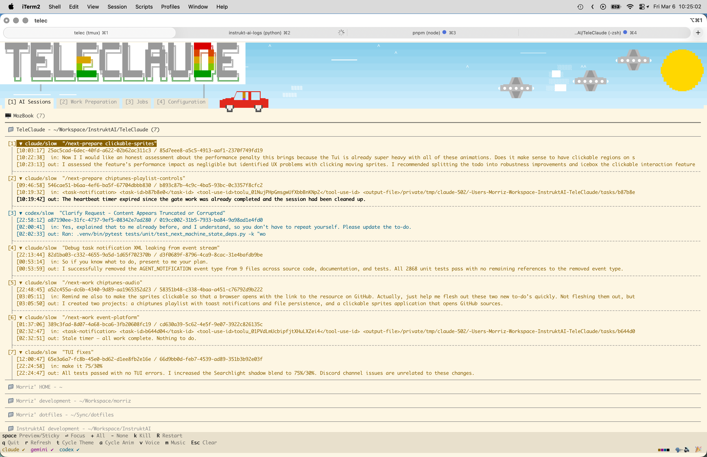
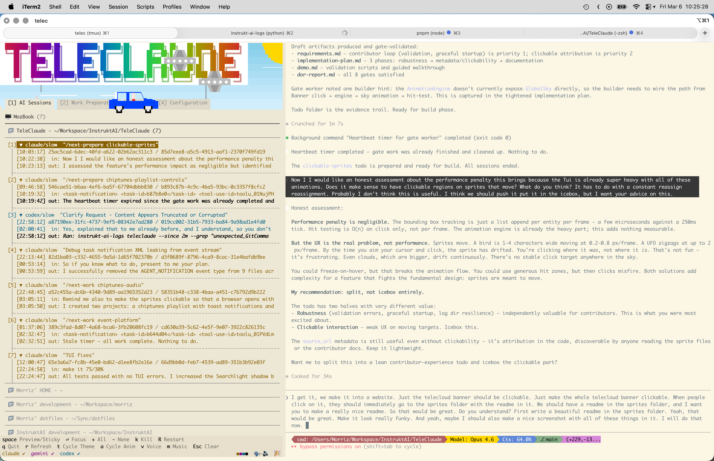

<![CDATA[```
                    ░░░▒▒▓▓▇▇▓▓▒▒░░░
               ░▒▒▓▇▇▇▇▇▇▇▇▇▇▇▇▇▓▒▒░
            ░▒▓▇▇▇▇▇▇▇▇▇▇▇▇▇▇▇▇▇▇▇▓▒░
           ▒▓▇▇▇▇  S P R I T E S  ▇▇▇▓▒
            ░▒▓▇▇▇▇▇▇▇▇▇▇▇▇▇▇▇▇▇▇▇▓▒░
               ░▒▒▓▇▇▇▇▇▇▇▇▇▇▇▇▇▓▒▒░
                    ░░░▒▒▓▓▇▇▓▓▒▒░░░
```

# TeleClaude Sky Sprites

> **The sky above the TeleClaude banner is alive.**
> Birds flock across a daytime sky. Clouds drift with the weather.
> A UFO occasionally buzzes past. Cars cruise along the tab bar.
> At night, stars twinkle and the moon glows.
> All of this is built from Unicode block characters and a handful of Python.

<p align="center">
  
  
</p>

---

## What Lives in the Sky

| File | What it draws | Theme |
|------|--------------|-------|
| `celestial.py` | Sun and Moon — full-disc quarter-celestials anchored top-right | Both |
| `clouds.py` | Wisps, puffs, medium clouds, cumulus — 4 weather patterns | Both |
| `birds.py` | Small `v`/`^` flocks, large composite birds with body detail | Light |
| `ufo.py` | Multi-layer flying saucer with hull, cockpit, and port lights | Both |
| `cars.py` | Left-facing and right-facing cars with body, head, wheels, tyres | Both |

The engine picks weather (`clear` / `fair` / `cloudy` / `overcast`), spawns the
matching cloud group, scatters birds and standalone entities, and lets everything
drift at its own speed and depth. Day/night follows your terminal's dark mode.

---

## How Sprites Work

Every sprite is built from **Unicode block characters** — the half-blocks (`▄▀`),
quarter-blocks (`▖▗▘▙▚▛▜▝▞▟`), shade blocks (`░▒▓`), box-drawing (`━─`), and
geometric shapes (`◢◣◤◥●◖◗`) that your terminal already knows how to render.

No images. No fonts. No dependencies. Just Unicode and color.

### The Building Blocks

```python
from teleclaude.cli.tui.animations.sprites.composite import (
    CompositeSprite,   # A static multi-layer sprite
    AnimatedSprite,    # A sprite that cycles through frames
    SpriteLayer,       # One color layer (positive + negative chars)
    SpriteGroup,       # A population container with weighted spawn counts
)
```

**`SpriteLayer`** — one color layer. Each cell position is either:
- **Positive** (non-space) — rendered with `fg = color`
- **Negative** (non-space) — rendered inverted: `bg = color, fg = sky`
- **Space** — transparent, layer doesn't contribute

**`CompositeSprite`** — stack of layers rendered back-to-front. Layer 0 first, last layer on top.

**`AnimatedSprite`** — cycles through frames. Each frame is a `CompositeSprite` or plain `list[str]`.

**`SpriteGroup`** — defines a population: how many of each sprite to spawn, with weighted randomness.

### Depth, Position, and Speed

Every sprite declares three weight distributions:

```python
z_weights=[(30, 50), (40, 50)]       # depth: Z-level → weight
y_weights=[(0, 2, 40), (3, 6, 60)]   # height: (y_lo, y_hi) → weight
speed_weights=[(0.2, 30), (0.5, 70)]  # drift: pixels/frame → weight
```

The engine picks from these distributions at spawn time. A sprite at Z30 renders
behind the banner letters; at Z70 it passes in front of the tab bar.

```
Z-Depth Scale (0 = deepest, 100 = frontmost)
─────────────────────────────────────────────
  0  sky gradient
 10  stars
 20  celestial (sun/moon)
 30  far clouds
 40  billboard (banner plate)
 50  mid clouds
 60  inactive tab panes
 70  near clouds / tab bar
 80  active tab pane
 90  foreground
─────────────────────────────────────────────
```

---

## Create Your Own Sprite

### 1. Draw it

Start simple. A single-layer sprite is just a list of strings:

```python
# my_sprite.py
from teleclaude.cli.tui.animations.sprites.composite import CompositeSprite, SpriteLayer

MY_SPRITE = CompositeSprite(
    layers=[
        SpriteLayer(
            positive=[
                " ◢█◣ ",
                "█████",
                " ◥█◤ ",
            ],
            color="#FF6600",
        ),
    ],
    z_weights=[(30, 50), (50, 50)],
    y_weights=[(1, 5, 100)],
    speed_weights=[(0.3, 50), (0.6, 50)],
)
```

For multi-layer sprites (like the UFO with hull + cockpit + lights), add more
`SpriteLayer` entries. Layers render back-to-front.

For **animated** sprites (like flapping birds), use `AnimatedSprite` with a list of frames:

```python
MY_ANIMATED = AnimatedSprite(
    frames=[
        ["v"],   # frame 0: wings up
        ["^"],   # frame 1: wings down
    ],
    z_weights=[(30, 100)],
    y_weights=[(0, 5, 100)],
    speed_weights=[(0.3, 100)],
)
```

### 2. Register it

Add your import and export to `__init__.py`:

```python
from teleclaude.cli.tui.animations.sprites.my_sprite import MY_SPRITE

__all__ = [
    # ... existing entries ...
    "MY_SPRITE",
]
```

That's it. The engine auto-discovers anything in `__all__` that has `z_weights`.

### 3. Test it

```bash
telec          # launch the TUI — your sprite should appear in the sky
```

Press **`a`** to cycle animation modes. Press **`u`** to force-spawn a UFO (proof
the spawn system works). Your sprite will drift across the banner at the speed and
depth you defined.

If your sprite has an error (e.g., `SpriteGroup` weights don't sum to 1.0), you'll
see a clear error message on startup telling you exactly what went wrong.

### 4. Theme filtering

Want your sprite to only appear in dark mode or light mode?

```python
MY_NIGHT_SPRITE = CompositeSprite(
    layers=[...],
    z_weights=[...],
    y_weights=[...],
    speed_weights=[...],
    theme="dark",     # only appears at night
)
```

### 5. Color variants

Use a list for random color selection at spawn time:

```python
SpriteLayer(
    positive=["███"],
    color=["#FF0000", "#00FF00", "#0000FF"],  # random pick per spawn
)
```

---

## Unicode Character Reference

Your terminal is a pixel canvas. Here are the characters that make sprites pop:

```
Half blocks       ▀ ▄ █ ▌ ▐
Quarter blocks    ▖ ▗ ▘ ▙ ▚ ▛ ▜ ▝ ▞ ▟
Eighth blocks     ▁ ▂ ▃ ▅ ▆ ▇ ▔
Shade blocks      ░ ▒ ▓
Triangles         ◢ ◣ ◤ ◥
Circles           ● ◖ ◗ ◉ ◎
Box drawing       ━ ─ │ ╱ ╲
Geometric         ◆ ◇ ▲ ▶ ▼ ◀
Sparkles          ✦ · * +
Braille           ⠁ ⠃ ⠇ ⠏ ⠟ ⠿ (for fine detail)
```

**Tip:** Space characters are transparent. Use them to shape the outline of your sprite.

---

## Architecture Notes

- Sprites are pure data — no runtime logic, no I/O, no imports beyond `composite.py`
- The `GlobalSky` animation in `general.py` owns the lifecycle: spawn, drift, wrap, respawn
- Z-buffer compositing handles occlusion — sprites pass behind and in front of the banner
- The engine runs at ~250ms tick intervals; sprite movement is fractional (sub-pixel accumulation)
- Weather changes every 30-120 minutes; entity populations are re-rolled on weather change

---

<p align="center">
  <sub>
    The sky is open. Add a satellite. A hot air balloon. A dragon. A paper airplane.
    <br>
    Whatever you draw with Unicode, the engine will carry it across the sky.
  </sub>
</p>
]]>