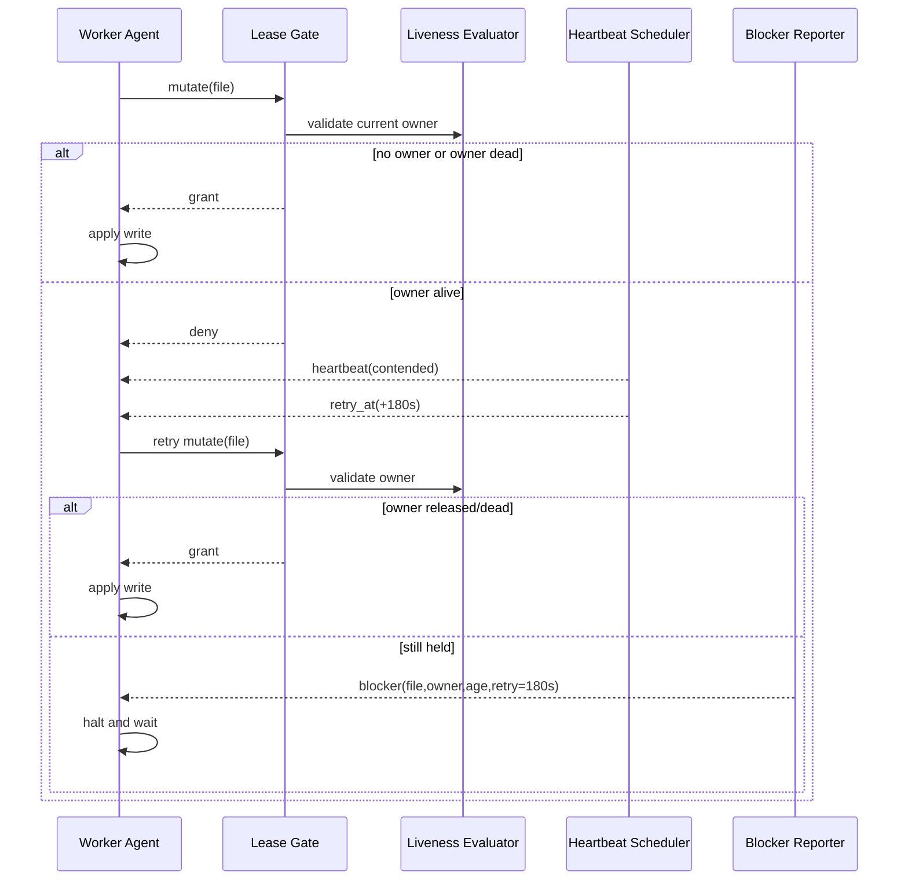

# Implementation Plan: Transparent Lease Control with Heartbeat Retry

## Outcome

A deterministic, transparent file lease layer that prevents same-file collisions
on `main` without shifting operational burden to agents.

## Delivery Phases

## Phase 1: Lease Contract and Data Model

1. Define lease record contract:
   - file key,
   - owner identity,
   - acquired_at,
   - last_heartbeat_at,
   - lease_state.
2. Define liveness contract for ownership validity.
3. Define blocker payload schema.

Exit criteria:

1. Contract docs are explicit and unambiguous.

## Phase 2: Runtime Lease Gate

1. Insert transparent lease gate at mutation boundary.
2. Enforce single-owner rule before write application.
3. Ensure denial path returns structured contention event.

Exit criteria:

1. Competing same-file write is denied deterministically.

## Phase 3: Heartbeat + Deferred Retry

1. Emit contention heartbeat on deny.
2. Schedule one retry at +180s.
3. Enforce no short-loop retries.

Exit criteria:

1. Runtime behavior is exactly: heartbeat -> wait -> retry.

## Phase 4: Lifecycle Release and Liveness Reclaim

1. Release on commit success.
2. Release on hard failure/end.
3. Reclaim on owner-not-alive.
4. Release on stop-idle 30s inactivity window.

Exit criteria:

1. Dead/non-active owner never retains lease.

## Phase 5: Blocker Halt Behavior

1. If retry still blocked for required file, hard-stop path.
2. Emit full blocker report and hold for instruction.
3. Prohibit silent skip behavior.

Exit criteria:

1. Blocked required work always surfaces as explicit halt.

## Runtime Sequence Diagram

## Test Plan

1. Unit: lease acquire/deny/release.
2. Unit: liveness reclaim invalidates dead-owner lease.
3. Unit: stop-idle 30s release behavior.
4. Unit: heartbeat + +180s retry scheduling.
5. Integration: two-agent same-file contention.
6. Integration: blocked-after-retry -> halt + blocker contract.

## Risks and Mitigations

1. Risk: false dead-owner detection.

- Mitigation: conservative liveness check + explicit timestamps in report.

2. Risk: lock invisibility causes operator confusion.

- Mitigation: checkpoint/report includes held/blocked/retry context only when relevant.

3. Risk: retry queue drift under heavy load.

- Mitigation: monotonic retry scheduling and deterministic interval tests.

## Definition of Done

1. Same-file concurrency collisions are blocked deterministically.
2. Dead owners cannot retain leases.
3. Retry contract is exactly 3 minutes.
4. Required blocked work hard-stops with clear operator report.
5. Agent commit ownership remains unchanged.
