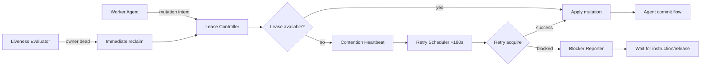
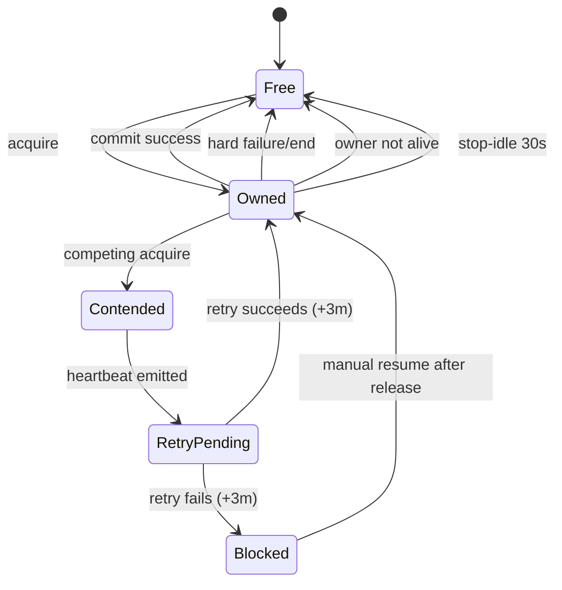

# Requirements: Transparent File Lease Control on Main

## Intent

Prevent same-file concurrent edits between active agents on `main` while preserving
fast operator workflow and agent commit ownership.

## Why

Without concurrency control, two agents can mutate the same file and create
high-noise conflict cleanup and accidental overwrite risk.

## Scope

### In scope

1. Transparent per-file lease acquisition on mutation attempts.
2. Lease ownership bound to owner liveness.
3. Deterministic contention handling: heartbeat -> retry at +3m -> halt/report.
4. Deterministic release triggers (commit/failure/end/stop-idle/liveness-loss).
5. Standard blocker report contract.

### Out of scope

1. Daemon-owned commit or staging flows.
2. Branch/worktree workflow changes.
3. Repo-wide Git strategy redesign.
4. Cross-host global lock coordination.

## Actor Model

1. Worker Agent

- Performs normal edit/commit behavior.
- Does not manually lock/unlock.

2. Lease Controller

- Intercepts mutation request at runtime boundary.
- Grants/denies lease ownership for each target file.

3. Heartbeat Scheduler

- Emits contention heartbeat and schedules +3m retry.

4. Liveness Evaluator

- Invalidates lease when owner is not alive.

5. Blocker Reporter

- Emits deterministic blocker payload for operator action.

## Functional Requirements

### FR1: Transparent Lease Gate

1. Every file mutation MUST pass lease acquisition before write is applied.
2. Agent prompt/workflow MUST NOT require explicit lock commands.
3. Lease key MUST be normalized repo-relative file path.

### FR2: Single Owner Rule

1. At most one live owner MAY hold a lease per file.
2. If owner is live, competing mutation MUST be denied.

### FR3: Liveness Invariant

1. Non-live owners MUST NOT retain leases.
2. Lease checks MUST revalidate owner liveness before deny decisions.
3. Dead-owner lease MUST be reclaimable immediately.

### FR4: Contention Contract

1. On denied acquisition, system MUST emit contention heartbeat.
2. System MUST schedule next retry at exactly +3 minutes.
3. System MUST NOT perform rapid retry loops under contention.

### FR5: Retry Outcome Contract

1. If retry succeeds, workflow resumes normally.
2. If retry fails for required file, task path MUST hard-stop and wait.
3. No silent skip of required work is allowed.

### FR6: Release Contract

Leases MUST be released on:

1. successful commit completion,
2. hard agent failure,
3. explicit stop/end lifecycle event,
4. owner liveness loss,
5. post-stop inactivity timeout of 30 seconds.

### FR7: Blocker Report Contract

If still blocked after retry, report MUST include:

1. blocked file,
2. owner identity,
3. lock age,
4. last heartbeat timestamp,
5. retry interval (180s),
6. state=`waiting_for_instruction`.

### FR8: Commit Ownership Preservation

1. Agent remains sole actor for `git add`/`git commit`.
2. Lease system MUST NOT perform commit actions.

## Architecture Diagram

## Lock State Diagram

## Verification Requirements

1. Two concurrent agents targeting same file cannot both mutate it.
2. Contention emits heartbeat and schedules retry at +180s.
3. Required-file still blocked at retry causes hard-stop + blocker report.
4. Dead owner lease is reclaimed and next contender can proceed.
5. Stop-idle 30s releases lease when no further activity occurs.
6. Commit path remains agent-owned.

## Constraints

1. Main-branch dirty workflow remains supported.
2. Locking remains transparent to agent UX.
3. Determinism prioritized over speculative auto-recovery loops.
