# Redis Adapter Flows (Unified Architecture)

> **Created**: 2025-11-28
> **Status**: 📊 Architecture Diagram
> **Goal**: Visual representation of simplified Redis adapter patterns

## Overview

After the unified adapter architecture refactoring, Redis adapter has **two simple modes**:

1. **Client Mode** (MozBook): Pure transport - sends requests, reads responses
2. **Server Mode** (RasPi4): Handles requests, serves session data from files

**Key Simplification**: No streaming, no dual sessions, no special cases.

---

## AI-to-AI Session Flow (Complete)


---

## Simplified Architecture Comparison

### Before (Complex - Two Code Paths)


**Problems**:
- ❌ Dual sessions (local + remote)
- ❌ Output streaming via Redis streams
- ❌ Special AI session code paths
- ❌ Chunked output prevents message editing
- ❌ Complex state management

---

### After (Simple - One Code Path)


**Benefits**:
- ✅ Single session (remote only)
- ✅ Request/response pattern (no streaming)
- ✅ Unified coordinator (no branching)
- ✅ Message editing works (send_output_update)
- ✅ Simple state management

---

## Request/Response Pattern Detail

```mermaid
sequenceDiagram
    participant Client as Redis Adapter<br/>(Client)
    participant Streams as Redis Streams
    participant Server as Redis Adapter<br/>(Server)
    participant File as claude_session_file

    Note over Client,File: Pattern: Send request → Read response

    Client->>Streams: XADD messages:computer /session_data {metadata}
    Note right of Client: Request ID:<br/>session-data-1234567890

    Streams->>Server: XREAD (poll messages stream)
    Server->>Server: Handle /session_data command
    Server->>File: Read session file
    File-->>Server: Session content
    Server->>Streams: XADD response:request_id {data}

    Streams->>Client: XREAD (poll response stream)
    Client-->>Client: Parse JSON response

    Note over Client,File: ✓ Simple request/response<br/>✓ No streaming complexity<br/>✓ File is source of truth
```



---

## Observer Pattern Detail (Unchanged Conceptually)

```mermaid
sequenceDiagram
    participant Coordinator as Polling Coordinator<br/>(RasPi4)
    participant AdapterClient as Adapter Client
    participant Redis as Redis Adapter
    participant Telegram as Telegram Adapter
    participant Metadata as adapter_metadata

    Note over Coordinator,Metadata: Output changed event

    Coordinator->>AdapterClient: send_output_update(session_id, output, ...)

    AdapterClient->>AdapterClient: Broadcast to ALL adapters

    par Broadcast to Redis
        AdapterClient->>Redis: send_output_update()
        Redis-->>Redis: ✗ Not implemented<br/>(does nothing)
    and Broadcast to Telegram
        AdapterClient->>Telegram: send_output_update()
        Telegram->>Metadata: Get adapter_metadata["telegram"]
        Metadata-->>Telegram: {output_message_id: "123"}
        Telegram->>Telegram: Edit message 123
        Telegram->>Metadata: Update adapter_metadata["telegram"]
    end

    Note over Coordinator,Metadata: ✓ Unified pattern for all adapters<br/>✓ Telegram edits ONE message<br/>✓ Redis does nothing (no streaming)
```



---

## Command Routing Architecture


**Key Insight**: `/session_data` command is handled by BaseAdapter, so ALL adapters (Telegram, Redis, future Slack/WhatsApp) automatically support it.

---

## Removed Components

### ❌ Deleted from Architecture

1. **`teleclaude__observe_session` MCP Tool**
   - Not needed - observation happens automatically via adapter_metadata
   - Remote MCP client doesn't observe, it pulls data via `teleclaude__get_session_data`

2. **`_send_output_chunks_ai_mode()` Function**
   - Replaced by unified `send_output_update()` for all sessions

3. **`_is_ai_to_ai_session()` Function**
   - No more branching by session type

4. **Redis Output Streams**
   - Replaced by request/response pattern reading session files

5. **Local Session Creation (Client Mode)**
   - Client no longer creates local DB sessions or session files

6. **Output Stream Listeners**
   - `_output_stream_listeners` dict and all polling logic removed

---

## Summary

### Unified Adapter Pattern Achieved

**One principle**: All adapters work the same way
- **Telegram**: Edits messages using adapter_metadata
- **Redis**: Serves session data from files via request/response
- **Future adapters**: Follow same patterns

**One coordinator path**: No special cases for AI sessions
```python
# Before: if is_ai_session: ... else: ...
# After: (unified for all sessions)
await adapter_client.send_output_update(session_id, output, ...)
```

**One source of truth**: Session files
- Claude Code already stores everything
- All adapters read from same source
- No duplicate storage or streaming

**Result**: 30% code reduction, zero special cases, easier to maintain.
